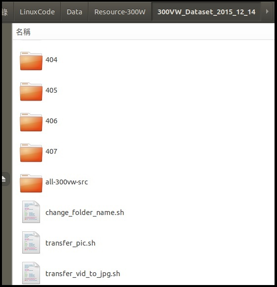
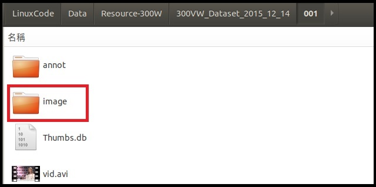
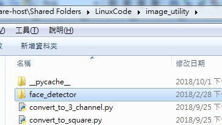
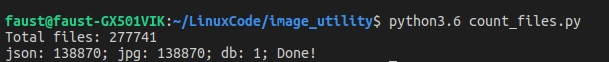
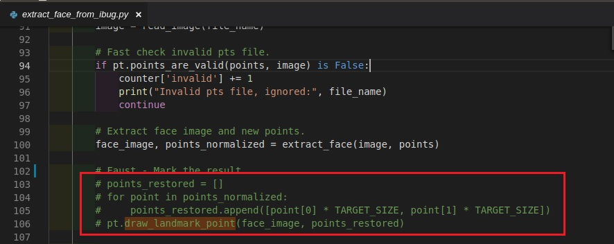
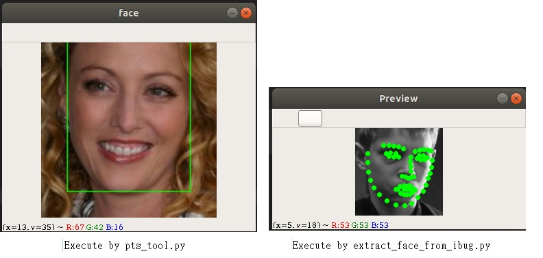
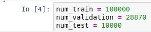
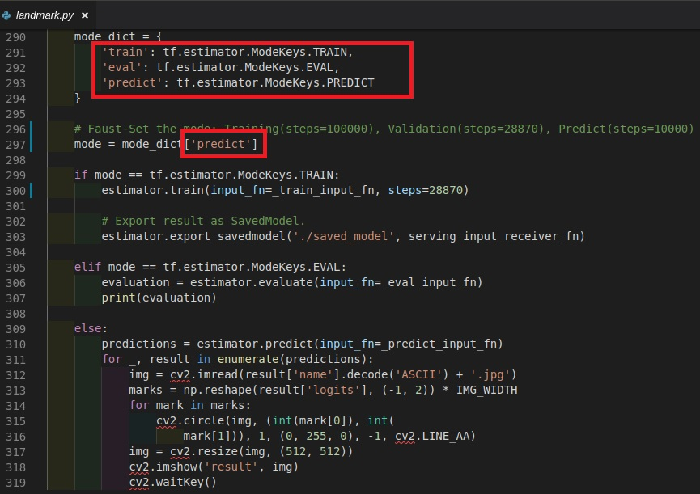
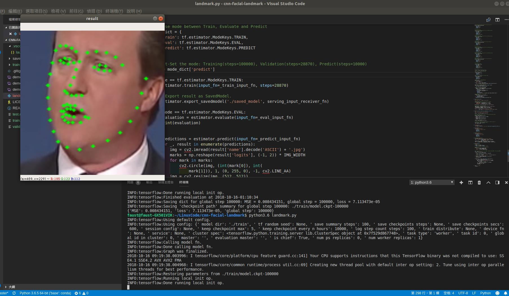

# cnn-facial-landmark-tutorial Introduction
This document is the essentially setup for cnn-facial-landmark program written by **Yin Guobing**.
[original text link](https://github.com/yinguobing/cnn-facial-landmark)  
This is great good implement about the facial landmark detect and I showed the way how I prepared the input data and the running process for the program. You can create the input data step by step by the following context, or download the input data already processed by myself in the following link:[resource link](https://drive.google.com/drive/folders/1nW_b4LdWN8S-v1Gw1j-JNIJhx6Ucun9N?usp=sharing)

# Running facial-landmark-tutorial
##Environment
System: Ubuntu 18.04

Installation: python3.6.3, OpenCV(>= v3.4.2), FFmpeg 

(Please refer to the [**Installation**](Installation.md).)

##Download resource
The initial picture and pts(contains 68 facial-landmark point) link.

[**300-W**](https://ibug.doc.ic.ac.uk/resources/facial-point-annotations/) : In this link, I download 300W,afw,helen,ibug and lfpw.

[300-VW](https://ibug.doc.ic.ac.uk/resources/300-VW/):This is .avi file and you can capture the image by "**transfer_vid_to_jpg.sh**" and move all image to a folder(folder name: **all-300vw-src**) by **transfer_pic.sh**. 

step 1: Copy the script to 300VW folder.

step 2: Executes command "**sh transfer_vid_to_jpg.sh**" in terminal, and it create images folder on all different folders.

step3: Executes command "**sh transfer_pic.sh**", and it transfer all pictures to /all-300vw-src.

##Verify resource

You can download the the code by git, and replace the "**pts_tools.py**" modified by me:

$ git clone https://github.com/yinguobing/image_utility.git

[face_detector](https://anonfile.com/W7rdG4d0b1/face_detector.rar):Copy "**face_detector**" to "**image_utility**", which can avoid the fail "**Can't open "face_detector/deploy.prototxt" in function 'ReadProtoFromTextFile'**".

[count file](https://github.com/yinguobing/image_utility/blob/master/count_files.py): Calculates the total file numbe, and the picture shows the total file number of my input data.

You can verified if the resource is OK by"**pts_tool.py**" and "**extract_face_from_ibug.py**", and enable the red part in the following picture. **After verify finished, you should disable this red part.**

##Extract face from ibug
[extract face from ibug](https://github.com/yinguobing/image_utility/blob/master/extract_face_from_ibug.py):It can extract face for all pictures, and you need to set the following two parameters in this file. 

**DATA_DIR**:The input source file path

**TARGET_DIR**:The Target file path which you want to store.

##Transfer input data to tfrecord format

You can download the the code by git, and change to branch ibug:

$ git clone https://github.com/yinguobing/tfrecord_utility.git

$ git checkout ibug 

[Generate CSV](https://github.com/yinguobing/tfrecord_utility/blob/ibug/generate_csv.py):Generate the "**data.csv**"

[Split CSV](https://github.com/yinguobing/tfrecord_utility/blob/ibug/split_data.ipynb):

$ cd tfrecord_utility

$ jupyter notebook

Browser to "**split\_data.ipynb**" and set the value as the following in my case. Runs all steps until the program runs successfully. Finally, it will split "**data.csv**" to "**data\_train.csv**","**data\_validation.csv**",and "**data\_test.csv**".

Copy the three csv file to data folder, and executes "**generate\_records.sh**". It will generate the three tfrecords:"**train.record**","**validation.record**",and "**test.record**".

##Execute Training, Validation, and Predict
You can download the the code by git, and change to branch master:

$ git clone https://github.com/yinguobing/cnn-facial-landmark.git

$ git checkout master

Copy three tfrecords to "**cnn-facial-landmark**", and set the mode_dict sequentially. The final picture is the predict mode.

**train**: training mode

**eval**: validation mode

**predict**: predict mode

